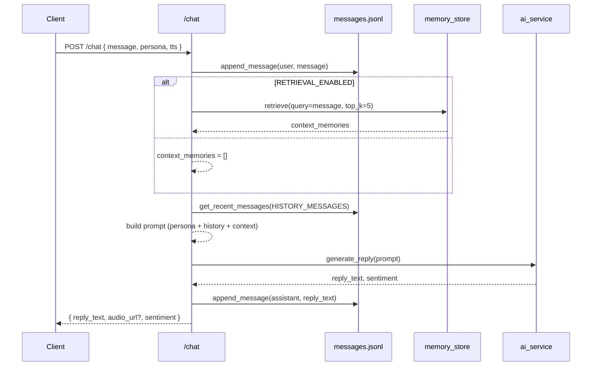

# Retrieval & Conversational Memory Flow

This document describes how `helloEx` retrieves context and maintains conversational memory in the backend.

## Components

- **Router**: `routers/chat.py`
- **Vector store**: `services/embedding_service.py` exposes `memory_store` backed by one of:
  - File JSONL (default)
  - ChromaDB
  - Milvus
- **Ingestion**: `services/ingestion_service.py` populates the active `memory_store` via `memory_store.add()`
- **History buffer**: `utils/text_utils.py` via `append_message()` and `get_recent_messages()`
- **Prompting**: `utils/text_utils.build_prompt()`
- **LLM gateway**: `services/ai_service.py`

## Environment Toggles

- `RETRIEVAL_ENABLED=true|false`
- `VECTOR_BACKEND=file|chroma|milvus`
- `HISTORY_MESSAGES=6` (how many recent messages to include)
- ChromaDB: `CHROMA_DIR`, `EMBEDDING_MODEL_NAME`
- Milvus: `MILVUS_HOST`, `MILVUS_PORT`, optional `MILVUS_USER`, `MILVUS_PASSWORD`, `MILVUS_DB`, `MILVUS_COLLECTION`, `MILVUS_INDEX_TYPE`, `MILVUS_METRIC_TYPE`

## High-Level Flow



## Ingestion Flow (RAG)

```mermaid
flowchart TD
  A[Upload files to /ingest/upload] --> B[ingestion_service.ingest_*]
  B --> C[clean_text + chunk_text]
  C --> D[memory_store.add(text, tags)]
  D -->|file| E[data/storage/memory.jsonl]
  D -->|chroma| F[data/chroma collection]
  D -->|milvus| G[Milvus collection]
```

## Backend Selection

- File store uses `utils.text_utils.simple_embed()` and naive cosine similarity.
- ChromaDB uses `sentence-transformers` embeddings with persistent client.
- Milvus uses `sentence-transformers` and auto-creates collection and index.

## Notes

- Changing `VECTOR_BACKEND` switches both ingestion target and retrieval source.
- History is always appended to `messages.jsonl` regardless of backend.
- Tests disable retrieval and bind file backend for isolation.
